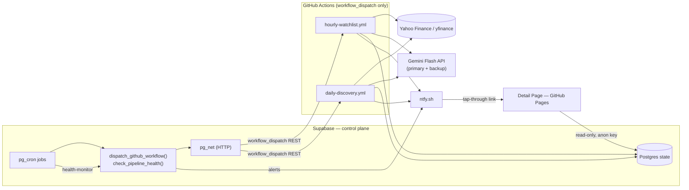
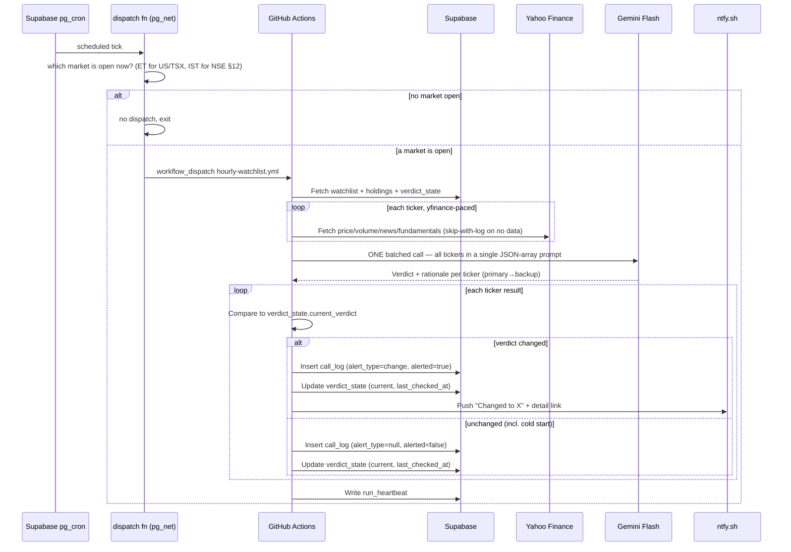

# Stock Advisory Agent — Solution Design (v13)
 
**Owner:** Arjun (solo build reference)
**Status:** Phases 0–5 live; QA batch #6–#12 resolved. **v13 is a doc-only pass** closing three access-
control ambiguities surfaced by a cross-functional consistency review (Requirements ↔ UI-handoff ↔ SD,
2026-06-30): (1) the detail page's UUID-only access posture is now a ratified Requirements decision, not
an unstated SD assumption; (2) the dashboard's access mechanism (client-side JS password gate) is now
ratified rather than "TBD at build time"; (3) GitHub issue **#15**'s scope was expanded to bundle a basic
`holdings` input-validation guard into the same NSE/INR constraint migration. **No code, schema, or
behavior changed in this pass** — see the v13 note in the history file for full detail. v12's *code-ahead*
reconciliation (five items marked shipped: §4.3 earnings signal, §4.6 FR23 push, §4.7 FR23 detail-page
dual-tz, §4.7 position block, §8 scheduler DDL) and its §12 schema-claim correction stand unchanged.
Genuine gaps remain filed, not fixed: new-candidate market badge (**#13**), retired-`reminder` CHECK
(**#14**), NSE/INR CHECK widening + validation guard (**#15**), missing `watchlist` SELECT RLS (**#16**),
"rate-limited" misattribution (**#17**). §12 (NSE) and §13 (dashboard) remain confirmed-but-unbuilt.
**Companion docs:** `stock-advisory-agent-requirements.md` (**v3 — source of truth**);
`stock-advisor-ui-handoff-v3-spec.md` (**v3 — rendering authority**);
`stock-advisory-agent-solution-design-history.md` (change history).
 
> **Change history moved out (token hygiene).** The full v2–v9 dated change-note stack now lives in
> `stock-advisory-agent-solution-design-history.md`. This working document carries the **current-state**
> design only. The handful of decisions whose *rationale* is load-bearing — the ones a future reader
> could otherwise undo by accident — are distilled in §0 below.
 
---
 
## 0. Load-bearing decisions (read before changing anything)
 
These are the "why it is this way" calls that are easy to reverse without realizing the cost. Full
provenance is in the history file; the short version:
 
1. **Single-rule alerting (issue #11, §6.3).** Any verdict change → immediate alert; no change →
   silence. No cooldown, no debounce, no 7-day reminder (FR7 retired). The old cooldown/reminder added
   state that wasn't earning its keep on a single-user push tool. Accepted cost: alert bursts on a
   choppy day. **Don't re-add a cooldown/debounce without a real, observed volume problem.**
2. **Signal on crossings, not standing states (§2 item 4, §6.3).** A standing Buy/Sell that never
   changes is silent by design — there is no bootstrap re-announce. A logged change is one threshold
   crossing, not proof of a durable signal; read the track record that way.
3. **Gemini fallbacks were never quota/RPD (§2 item 3, §4.4a).** The real cause was a client-side
   timeout firing on slow-but-valid (already token-billed) responses, plus occasional 503s — fixed
   with `GEMINI_TIMEOUT_MS=180s`. The real reason is logged in `fallback_from`; **don't call fallbacks
   "rate-limiting."**
4. **Supabase pg_cron is the clock, not GitHub cron (§4.1).** GitHub's shared scheduler silently
   dropped most ticks. The **runtime market gate, not the schedule, is the authority** on whether work
   happens — the schedule fires loosely and the ET gate trims it. Never trust the schedule to mean
   "market open."
5. **Reliability is an active dead-man monitor (§4.8, NFR2).** It must surface a run that *never
   triggers*, not only one that runs and fails. Known limit: it lives in the same pg_cron it watches
   (single point of failure, §2 item 6); an out-of-band ping is the unbuilt mitigation.
6. **One batched AI call per run, not per ticker (§4.4, §4.4a).** This is what keeps the system under
   the free-tier daily request cap. `data_snapshot.tokens` is a **per-batch total replicated on every
   row** — dedup per run, never sum per row.
7. **Discovery uses Yahoo's live screener, not a maintained universe (§4.3).** `candidate_universe`
   is vestigial — there is no seed/quarterly-refresh ownership burden. Don't reintroduce one.
8. **AI fails safe to Hold (§4.4a, §6.3).** A parse/API failure logs a fail-safe Hold, and the
   non-reading guard stops it from being read as a real change — so a bug can only ever *miss* a
   signal, never *fabricate* one. Keep that guard.
## 1. Purpose of This Document
 
The requirements doc closes the product questions. This doc closes the engineering ones — how the
system is actually built, what runs where, what persists, and what a dev/test team needs to execute
without guessing. Three architecture decisions were confirmed before v1 and remain locked:
 
| Decision | Choice |
|---|---|
| Candidate discovery method | Prefiltered universe (movers/volume/earnings) → AI judges shortlist |
| AI model | Gemini Flash, free tier (model names now configurable, §4.4) |
| State persistence | Supabase (Postgres) — now also the **scheduler and the watchdog** (§4.1, §4.8) |
 
A v6-era shift worth stating up front: Supabase has grown from "the database" into the **control
plane** — it persists state, triggers both workflows (pg_cron), and runs the health monitor. That
concentration is deliberate (one reliable mechanism beat GitHub's flaky scheduler) but it makes
Supabase a single point of failure for the whole trigger-and-watchdog path — see §2, item 6.
 
---
 
## 2. Accepted Risks (documented, not hidden)
 
1. **Gemini free tier trains on your prompts.** Google's free-tier terms allow using submitted
   prompts/responses to improve their models — paid tier and Vertex AI don't. This system sends your
   watchlist, holdings, and cost basis through that pipeline. Accepted for v1 given the $0–15/month
   budget; the swap to Claude Haiku via the Anthropic API is a small, isolated change (§4.4).
2. **Yahoo Finance's API is unofficial** — no SLA, no guarantee TSX (or NSE, §12) fundamentals stay
   complete. Day-one smoke test is mandatory (§9, Phase 0) before anything builds on top of it.
3. **Free-tier quotas move — but the observed fallbacks were never quota (corrected v7).** Google
   tightened Gemini free-tier limits twice in the past year; re-verify model names and RPM/RPD against
   live docs at build time. **What the doc previously implied — that fallbacks were RPD/quota — was
   wrong.** Live captured data (issue #10) shows the actual fallback cause was a **503 high-demand**
   response, and the original *recurring* fallbacks were a **client-side timeout firing on slow-but-
   valid responses** — not 429/RPD exhaustion at all. The 180s timeout fix (§4.4a) was the correct
   remedy; only the attribution was off. The real exception is now captured per call in
   `call_log.data_snapshot.fallback_from`, so "why did it fall back" is read from the log, never guessed.
   Actual RPD *sustainability* is a separate standing ops note, not this fallback story — see §11.
4. **No spam control — verdict non-determinism surfaces directly as alerts (v6, issue #11).**
   Gemini's verdict isn't deterministic — the same data can return Buy on one run and Hold on the
   next. With the debounce (removed v3) **and now the 24h cooldown (removed v6)** both gone, every
   verdict change alerts immediately and **nothing caps the frequency.** On a choppy day, a verdict
   that oscillates Buy→Hold→Buy (whether from real volatility or model noise) pushes on *every* flip.
   This is the accepted cost of the single-rule design's simplicity (§6.3). The track record (§ success
   criterion in requirements) must be read with this in mind: a logged change is the model crossing a
   threshold once, not proof of a real signal. **Corollary (v7): the system signals on threshold
   *crossings*, not standing states** — a verdict that is actionable but unchanged (e.g. a standing Buy
   after cold start) is deliberately silent, because nothing crossed. If alert volume becomes a problem
   in practice, the documented re-adds are the "2 of last 3 runs agree" debounce or a minimal cooldown
   — both live in git history.
5. **NYSE/TSX holiday calendars diverge.** The two markets share trading *hours* but not *holidays*.
   The open-market gate is hours-and-weekday only (now per-market, §4.1/§6.1) and does not consult a
   per-exchange holiday calendar; a closed market's tickers fall through to skip-with-log (§7.5).
   Accepted over wiring a market-calendar library. (NSE, §12, adds a third holiday calendar — same
   posture.)
6. **Supabase is a single point of failure for trigger + watchdog (new, v6).** Scheduling (pg_cron
   dispatch) *and* monitoring (pg_cron health-monitor) both live in Supabase. If Supabase pg_cron
   stops, nothing dispatches **and** nothing warns that nothing dispatched — the dead-man monitor
   dies with the thing it's supposed to watch. Accepted for a single-user free-tier tool; the honest
   mitigation if this ever matters is an external uptime ping (e.g. a free cron-monitor hitting a
   heartbeat URL) as an out-of-band watcher. Noted, not built.
7. **Dashboard auth is constrained by a static host (new, v8).** The dashboard (§13) lives on GitHub
   Pages, which has **no server-side auth** — so access control can only be a client-side gate (a JS
   password prompt against a hashed value) or a host-level layer in front (e.g. Cloudflare Access).
   FR19 forbids unauthenticated public access; a JS gate is *obfuscation, not real security* (the data
   is reachable by anyone who reads the anon-key requests). Acceptable only because the data is
   informational and read-only (NFR3) and the anon key is RLS-scoped to two tables (§13). If the
   data sensitivity bar ever rises, Cloudflare Access (or moving the dashboard off a static host) is
   the real fix. The mechanism choice is a build-time decision (§13); the *constraint* is recorded here.
   **(Ratified v13: the JS-gate choice is now a Product decision — Requirements Decision Log #11 — not
   just an SD-side architecture call.)**
---
 
## 3. High-Level Architecture
 

 
The shape changed in v6: the trigger arrow no longer originates inside GitHub. **Supabase pg_cron
is the clock**; it calls GitHub's dispatch API over `pg_net`, and a third pg_cron job is the
watchdog. GitHub Actions is now purely an execution surface.
 
---
 
## 4. Components
 
### 4.1 Scheduler — Supabase pg_cron → GitHub `workflow_dispatch` (rewritten in v6)
 
**What changed and why.** v5 specified GitHub Actions native `schedule:` cron. In production that
proved unreliable to the point of breaking the product — GitHub's shared scheduler silently *drops*
scheduled events under load (observed: a `*/30` schedule executed roughly 3 of ~16 expected daily
ticks). Dropped ticks fail *silently*, which is the worst failure mode for a system whose whole job
is to not miss things.
 
**Current design (live):**
- Both workflows are **`workflow_dispatch`-only**; the native `schedule:` blocks are removed.
- Supabase **`pg_cron`** holds the schedule and calls a `SECURITY DEFINER` function
  `dispatch_github_workflow(workflow_file, inputs)` which reads a GitHub PAT from **Supabase Vault**
  and POSTs the dispatch via **`pg_net`**.
- This makes the *trigger* reliable. It does **not** make the trigger smart about market hours —
  and that distinction is the load-bearing safety principle, carried over verbatim from v5:
> **Never trust the schedule alone to mean "the market is open."** The schedule fires more often
> than strictly needed; the **runtime market gate is the real authority** on whether work happens.
> This is the single most common bug in scheduled trading scripts, and moving to a reliable
> scheduler does not retire the gate — it just means the gate now runs against a clock that actually
> ticks.
 
**ET-aware, DST-correct gating (live — issues #9, #12).** The gate/window math previously used fixed
UTC offsets, which couldn't track the ET market close across daylight-saving transitions — the symptom
was post-close no-op dispatches (#9) and a daily false "watchlist stalled" alert (#12). **Now shipped:**
- `public.dispatch_watchlist_if_open()` gates the watchlist dispatch on
  `(now() at time zone 'America/New_York')::time between '09:30' and '16:00'` **plus** a weekday check,
  then calls `dispatch_github_workflow('hourly-watchlist.yml')`. The watchlist-dispatch cron is
  re-pointed at this gate.
- The wide `*/30 13-21 UTC` cron **stays as the DST superset** — it fires more often than needed and
  the ET gate trims it down to the live session, so the schedule never has to be edited twice a year.
  This is the "schedule fires loosely, the gate is the authority" principle made concrete.
- Python `is_market_open()` **remains as execution-time defense-in-depth** — the dispatch gate and the
  runtime gate now agree, both computed in `America/New_York`. **All market-hour gating is computed in
  ET, never in fixed UTC offsets.** (§12 extends this to a per-market gate with a second IST window.)
- Migration `issue_9_12_et_aware_gating` + a `cron.alter_job` re-point; commits `07d10e7f`, `516cbba0`.
**Safe forced-test pattern (live — issue #7).** `FORCE_RUN=true` bypasses the market gate; if
`ALERTS_ENABLED=true` at the same time, it fires **real** ntfy pushes regardless of market hours (one
such test push was briefly mistaken for a defect). `is_market_open()` itself is correct. Now shipped:
`run_hourly` prints a **`[gate]` audit line** (`market_open`, `force_run`, `alerts`, and both UTC + ET
time) on every run, and the `FORCE_RUN` branch documents that `ALERTS_ENABLED=true` sends real pushes
off-hours. **Documented safe pattern: for any off-hours forced run, set `ALERTS_ENABLED=false`.**
 
`daily-discovery.yml` is dispatched once after US/TSX market close on the same mechanism (fixed 22:00
UTC — discovery is not ET-gated, see §4.8).
 
### 4.2 Data Ingestion — `yfinance`
Single wrapper module used by both workflows. Pulls price/volume, basic fundamentals, and built-in
news headlines (`Ticker.news`) — one data dependency, no separate news vendor. US tickers are bare,
TSX use `.TO`, NSE (§12) use `.NS`. The ingestion layer is **market-agnostic** — it keys off the
ticker suffix and the `exchange` field yfinance returns, so adding a market is a config concern, not
an ingestion rewrite.
 
### 4.3 Candidate Sourcing & Prefilter (discovery only)
Makes FR4 ("scan beyond the watchlist, no fixed buy/sell criteria") buildable. **v9 correction:** the
SD previously described a maintained `candidate_universe` table pulled via `yf.download()`; that is
**not** how it works. The code (`prefilter.py`) sources candidates from **Yahoo's live server-side
screener** and applies quality gates + signals locally:
- **Sourcing — live screener, not a static universe.** Each day it pulls Yahoo's predefined screens
  `day_gainers`, `day_losers`, `most_actives` (US) plus a custom `region=ca` EquityQuery for Canada.
  There is **no maintained universe table**; the `candidate_universe` table in §5 is **vestigial**
  (seeded by no one, read by nothing) and should be dropped or ignored. This removes the
  "seed-and-quarterly-refresh" ownership burden the old SD invented — there's nothing to maintain.
- **Quality gates (all tunable):** minimum market cap (~$2B), price (~$5), daily volume (~500k), and
  an allow-list of real primary exchanges (NYSE/Nasdaq tiers + Toronto) — excludes OTC/pink/secondary.
- **Signals — a survivor must trip ≥1 of these (all four are FR4-backed per Requirements v3, Decision #14):**
  (1) **mover** — abs % change past the gainer/loser threshold;
  (2) **volume spike** — today's volume ≥ a multiple of the 3-month average;
  (3) **earnings proximity** — earnings within a near-term window *(FR4's third criterion; **live in
  `prefilter._signals()`**, tunable via `DISCOVERY_EARNINGS_DAYS`. Best-effort: applied only when the
  screener carries an earnings timestamp, tagging a name whose earnings are imminent or just reported)*;
  (4) **52-week-extreme** — price within a small fraction of its 52-week high/low. *FR4's fourth
  signal, canonicalized in Requirements v3 (FR4 + Decision #14). Previously flagged to Product as a
  proposed add; that add has landed, so it is now part of the canonical spec, not an extra.*
- The ranked shortlist (capped ~15/day) is the **only** thing that goes to the AI.
- **Dedup before notifying:** watchlist tickers are excluded up front; a candidate pushed in the last
  7 days is logged but not re-pushed ("log always, push conditionally").
- **Push policy — Buys only (v9, documented).** Discovery **pushes only `Buy` candidates**; `Sell`/
  `Hold` candidates are logged silently (no notification). This keeps discovery to high-signal nudges.
**Pre-gate observability + threshold tuning (live — issue #8).** Discovery can legitimately return 0
candidates on a quiet day, and the logs previously couldn't tell **"screened N, 0 passed the gate"**
from **"screened 0 (something upstream broke)."** Now shipped: `find_candidates()` returns a **funnel
dict** (`raw → after_dedup → passed_quality → passed_signal`) and `run_discovery` logs the
stage-by-stage drop-off, plus a count of screens that errored so a silent screener failure can't
masquerade as a quiet day. *3 consecutive zero-signal days is a tuning signal, not normal.* Commits
`253599fc`, `d4ef8681`.
 
**NSE discovery is in scope (§12, D5)** — NSE candidates use the same screener/gate/signal pipeline;
only the dispatch schedule is NSE-specific (post-NSE-close), per §12 D5.
 
### 4.4 AI Judgment Layer
- Model: Gemini Flash free tier. **Model names are configurable repo Variables, never hardcoded:**
  `GEMINI_MODEL` / `GEMINI_MODEL_BACKUP` (watchlist) and `DISCOVERY_GEMINI_MODEL` /
  `DISCOVERY_GEMINI_MODEL_BACKUP` (discovery), wired through `judge_batch(models=...)`. Swappable from
  the GitHub UI with no commit. **This Variable-driven pattern is the standard for any model-bearing
  component** — including the NSE pair in §12.
- **Dual-model fallback:** each call attempts the primary model, falling back to the backup. The two
  draw from **separate per-model quota buckets**, so backup capacity survives primary RPD exhaustion.
- **One batched call per run, not per ticker (v9 correction).** The whole watchlist is judged in a
  **single** `judge_batch()` Gemini call (and the discovery shortlist in one more) — a JSON array of
  verdicts, one object per ticker. This is what keeps the system far under the free-tier daily request
  cap, and it's why the token total is a per-batch number (§4.4a, §5). The earlier "one call per
  ticker" wording was wrong. Ingestion (yfinance) is still paced per ticker; the AI step is one call.
- Output is **strict JSON**, validated and retried — see 4.4a.
### 4.4a AI Prompt Specification (the actual product)
 
The system's value lives in this prompt. Specified so two developers build the same product.
 
**Verdict definitions** (operational):
- **Buy** — conditions favor opening or adding now.
- **Sell** — conditions favor reducing or exiting now. For held positions, relative to recorded cost
  basis and position size.
- **Hold** — no actionable change. The *default* and the most common output. Hold means "do nothing,"
  not "actively neutral." If the model is unsure, the answer is Hold.
The bias toward Hold is the brake that stops the system manufacturing action out of noise.
 
**Prompt template** (system + user split; fill `{...}` at runtime):
 
```
SYSTEM:
You are a disciplined, unemotional equity analyst. You output ONLY a single JSON
object and nothing else — no markdown, no code fences, no prose before or after.
Default to "Hold" unless the data clearly supports action. You do not assume any
fixed investment style or time horizon; weigh each stock on its own context.
 
Schema (all fields required):
{
  "verdict": "Buy" | "Sell" | "Hold",
  "rationale": "<one or two short, plain-language sentences; ≤280 chars stored>"
}
 
USER:
Ticker: {ticker} ({market})
Position: {held? "HELD" : "WATCH-ONLY"}
{if held:}  Shares: {shares}, Cost basis: {cost_basis} {currency},
            Current price: {price}, Unrealized P/L: {pl_pct}%
Price/volume (recent): {ohlcv_summary}
Fundamentals: {fundamentals_summary}
Recent news headlines: {news_headlines}
 
Give your verdict as JSON per the schema.
```
 
**Context serialization** — keep each block compact:
- `ohlcv_summary`: last close, % change 1d/5d/20d, volume vs. 20d average. **Newly-listed tickers:**
  a name with <~20 sessions can't fill the 20-day window — compute 1d/5d where history supports,
  pass the 20d fields as explicit `n/a (newly listed)`, never omit or fabricate.
- `fundamentals_summary`: P/E, market cap, 52w range — whatever yfinance reliably returns for *both*
  markets in scope. Phase 0 confirms per-market coverage; don't promise fields the source won't give.
- `news_headlines`: top 3–5 from `Ticker.news`, titles only.
**Model settings & batching (v9).** In the live code this prompt is sent as a **batch**: one call
carrying a numbered block per ticker and a `BATCH_SYSTEM_PROMPT` asking for a JSON *array* (one object
per ticker, every ticker exactly once); the single-ticker template above is the conceptual contract.
The call sets **`temperature=0.2`** (low, to reduce run-to-run drift — but verdicts are still
non-deterministic, §2 item 4) and `response_mime_type="application/json"`. **Rationale length:** the
model is asked for one or two short sentences; the stored value is capped at **280 chars**
(`RATIONALE_MAX`) and the push-notification body is separately clipped to **150 chars**
(`NOTIF_BODY_MAX`), on a word boundary with an ellipsis. UI handoff v3 is aligned to these limits
(280 stored / 150 push).
 
**Timeout & fallback handling (root cause confirmed by live data, v7):**
- The Gemini client uses an explicit **`GEMINI_TIMEOUT_MS` (default 180,000 ms / 180 s)** (commit
  `a0c86b00`). The prior default was too tight: it fired *before* a slow-but-valid response returned,
  the completed and **already-token-billed** response was discarded, and the call fell back to the
  backup model. The fallbacks looked like a quota problem and weren't.
- **Confirmed from live capture (issue #10):** the recurring fallbacks were that **client-side
  timeout**, and the remaining genuine fallbacks were transient **503 high-demand** responses —
  **not** 429/RPD exhaustion. The timeout fix was the right remedy; the earlier *attribution* to quota
  was wrong. Do not describe these fallbacks as rate-limiting.
- On any fallback, **the real exception is captured** (timeout, 503 high-demand, parse failure, or —
  if it ever genuinely occurs — 429/RPD) and written to `call_log.data_snapshot.fallback_from`, plus a
  run-level warning. The log is now the source of truth for "why did it fall back," not a guess.
**Parsing & retry strategy:**
1. Request JSON. Parse it.
2. On parse/schema failure → retry once with a terse "reply with ONLY the JSON object" appended.
3. On second failure → **log the failure, treat verdict as `Hold` (no alert), move on.** A malformed
   response never crashes the run and never gets guessed-at — failing safe to Hold means a parse bug
   can only ever *miss* a signal, never *fabricate* one.
4. Every raw model response (including failures) is written to `call_log.data_snapshot`.
**Token accounting (v6):** `usage_metadata` is logged into `data_snapshot.tokens
{prompt, output, thoughts, total}`. **Critical consumer contract:** `tokens` is a **per-batch total
replicated onto every row of that run** — to report usage, dedup per run, **never sum per row**, or
you'll multiply the true number by the ticker count.
 
Note: even with strict JSON the verdict is non-deterministic across runs. As of v6 this is **not**
dampened at all — see §2 item 4. The single-rule §6.3 has no cooldown to cap how often
non-determinism surfaces as an alert.
 
### 4.5 State & Persistence — Supabase
All durable state here (schema §5). Chosen over a flat file because the detail page (FR14) queries a
specific log row directly. In v6 Supabase also hosts the scheduler and watchdog (§4.1, §4.8).
 
### 4.6 Alerting — ntfy.sh
Free, no account, topic-based push, `click` field for tap-through (FR12–14). The notify module is
provider-agnostic behind a small interface (Pushover is a drop-in later). In v6 there is **one alert
kind for the watchlist — `change`** ("Changed to Buy"); the `reminder` kind is **retired** with FR7
(§6.3). Discovery pushes are labeled `new-candidate`. Health-monitor pushes come from Supabase
directly via `send_ntfy` (§4.8), not from the workflow.
 
**Notification timestamp — single market-matched timezone (FR23). ✅ Live.** A
push is **formatted server-side at send time**, where the device timezone is unavailable — so the
notification carries **one** timezone, chosen by the alert's market, and **no secondary**:
- US / TSX alerts → **ET** (`America/New_York`), e.g. `10:30 AM ET`
- NSE alerts → **IST** (`Asia/Kolkata`), e.g. `8:00 PM IST`
`notify._market_timestamp(market)` returns the market's wall-clock label; `_compose_body` prefixes it
to the rationale (`"{timestamp} · {rationale}"`) within `NOTIF_BODY_MAX=150`, word-boundary clipped.
Unknown/missing market falls back to ET. (NSE→IST is wired here already; the separate NSE ntfy *topic*
is the only notification piece still pending, as Phase-6 work — FR18/D7, §12.)
 
This is deliberately *not* the dual-timezone display used on the client-rendered surfaces (§4.7,
§13) — the server can't detect the device, and the market's own timezone is the unambiguous anchor
for "when did this happen." **Notification copy (titles/body for `change` and `new-candidate`) is
owned by UI handoff v3 — build to the handoff, not to prose invented here.**
 
### 4.7 Detail Page — GitHub Pages
Minimal static page; reads `log_id` from the query string, fetches that `call_log` row via a
read-only Supabase **publishable key** (`sb_publishable_…`, the client-safe key, RLS-scoped to read
`call_log`) — the **secret key** (`SUPABASE_SECRET_KEY`, server-only, bypasses RLS) is used by the
workflows, never shipped to the page. *(v9: "anon key" everywhere in this doc means the new-style
publishable/secret keys the code uses — Supabase renamed them.)* Security is "unguessable URL," which
only holds because `call_log.id` is a **UUID, not a serial** — a serial would be trivially enumerable.
Fine for informational data (NFR3).
 
**Held-position block (UI handoff). ✅ Live.** The handoff specifies a "Your
position" block on the detail page for held tickers — shares, cost basis, current price, unrealized
P/L — omitted for watch-only. **Shipped:** `state.build_position()` computes the P/L, `state._snapshot()`
persists a `position` object into `data_snapshot` for held tickers (absent for watch-only), and
`detail.html` renders the `posBlock` only when `snap.position` is present — no empty block. This makes
the "personalized to your holdings" promise (FR2/FR11) visible on the page. *(Note: exercised only when
a ticker is actually held — the live `watchlist` currently has 0 held tickers and `holdings` is empty,
so the block is correct but dormant until holdings are populated; ruled working-as-intended, not a gap.)*
 
**Detail-page access posture (ratified v13 — Requirements Decision #17).** The detail page has **no
auth gate** — security is the UUID-unguessable URL described above, and nothing more. This is now an
explicit Product decision, not an unstated SD assumption: FR19's access-control requirement scopes to
the **dashboard only**; the detail page's read-only/informational nature (NFR3) is the accepted
rationale for leaving it at UUID-only. If that scope ever needs to widen, it's a Requirements change,
not an SD one.
 
**Timestamp — client-rendered dual timezone (FR23). ✅ Live.** The detail page runs in the browser, so
the device timezone *is* available — it renders **device timezone primary, IST secondary in brackets**
(`Jun 19 · 10:04 AM ET (8:34 PM IST)`) via `Intl.DateTimeFormat().resolvedOptions().timeZone`, deduped
to a single timestamp if the device is already IST. `call_log.timestamp` is UTC (§5); conversion is
client-side (`detail.html fmtTs`/`clockIn`/`tzLabel`). Page layout and all variants are owned by
UI handoff v3.
 
### 4.8 Reliability — active dead-man monitor (rewritten in v6, NFR2)
 
**What changed and why.** v5's reliability story was "GitHub emails on failure + a queryable
heartbeat row." That only catches a run that *executes and fails*. It is blind to the failure mode
that actually bit us — a run that **never triggers at all** (dropped pg_cron tick, expired PAT,
disabled workflow). A passive heartbeat row no one reads is not a monitor.
 
**Current design (Phase 5, live):**
- A third pg_cron job, **`health-monitor`**, runs **`check_pipeline_health()`** on a schedule
  independent of the two workflows.
- It actively raises an **ntfy alert** (via `send_ntfy`) when: the watchlist heartbeat is **stale
  during market hours**, the daily **discovery run didn't fire**, or a run **completed degraded**.
- **`monitor_alerts`** (state table) dedups: alert on **state change** into a bad state, **re-alert
  per cooldown** while it stays bad, and emit **one recovery notice** when it clears. Helpers
  `_raise_monitor` / `_clear_monitor` encapsulate the transitions.
- DDL is version-controlled at **`sql/phase5_monitoring.sql`**.
**ET-aware monitor window (live — issue #12).** The monitor's watchlist staleness window is now
computed in ET: `(p_now at time zone 'America/New_York')::time between '10:15' and '16:00'`. It
previously used a **fixed UTC 14:30–21:30** window, which ran ~90 minutes past the EDT close and fired
a **daily false "stalled" alert at 20:50 UTC** — the defect #12 described. The **discovery** check
stays UTC-based (it watches the fixed 22:00 UTC dispatch, which has no DST dependency). Commit
`07d10e7f`; `sql/phase5_monitoring.sql` updated and re-applied.
 
**Known limit (see §2 item 6):** the monitor lives in the same Supabase pg_cron that triggers the
workflows, so it cannot catch a total Supabase/pg_cron outage. An out-of-band uptime ping is the
documented (unbuilt) mitigation.
 
---
 
## 5. Data Model (Supabase / Postgres)
 
| Table | Key columns | Purpose |
|---|---|---|
| `watchlist` | ticker, market (US/TSX/NSE), type (stock/ETF), status (held/watch-only), date_added | The ticker list (FR1, FR3); `market` now three-valued (§12) |
| `holdings` | ticker, shares, cost_basis, currency | Position data for gain/loss (FR2, FR11) |
| `candidate_universe` | ticker, market, active | **Vestigial (v9)** — not read by code; discovery uses Yahoo's live screener (§4.3). Drop or ignore. |
| `verdict_state` | ticker, current_verdict, last_checked_at | Change-detection for the single rule (§6.3) |
| `call_log` | id (**uuid**), ticker, verdict, rationale, timestamp, label (watchlist/new-candidate), alert_type (**change/null**), alerted (bool), data_snapshot (jsonb) | Track record (FR15); detail-page source |
| `monitor_alerts` | check_name (PK), last_state, last_alerted_at, updated_at | Dead-man monitor dedup state (§4.8) |
| `run_heartbeat` | workflow_name, last_run_at, status | Per-workflow heartbeat the monitor reads (NFR2) |
 
**`verdict_state` is now physically three columns (v7): `ticker`, `current_verdict`,
`last_checked_at`.** Retiring the cooldown (issue #11) and the reminder (FR7) removed everything the
table carried to serve them — `last_alert_verdict`, `last_alert_at`, `reminder_due_at`, **and the
`bootstrapped` flag** (the v5-era #5 bootstrap mechanism, dropped with the single-rule cleanup) — are
all **gone**, along with the two-clock cold-start machinery v5 needed. The single rule only needs the
last-seen verdict to diff against and a checked-at timestamp. Migration `issue_11_shrink_verdict_state`.
This is the schema shrinking to match a simpler rule, deliberately.
 
**`call_log.alert_type` is now `change` or `null`** (the `reminder` value is retired with FR7).
*(⚠️ The live CHECK constraint still permits `reminder` — a vestige the schema hasn't dropped; no code
emits it. Tightening the constraint to `change`/null only is filed as issue **#14**.)*
Discovery `new-candidate` rows carry `alert_type=null`; the detail-page/notification headline keys off
`label` first (a `new-candidate` shows the bare verdict, no "changed to" prefix).
 
**`data_snapshot` (jsonb) contract (corrected to live code, v9):**
```json
{
  "price": 0.0, "pct_change_1d": 0.0, "pct_change_5d": 0.0,
  "pct_change_20d": 0.0,
  "volume_vs_avg": 0.0, "fundamentals": { "pe": 0, "market_cap": 0, "range_52w": [0,0], "currency": "USD" },
  "headlines": ["...", "..."],
  "raw_model_response": "<verbatim, for debugging>",
  "parse_status": "ok | retried | failed | api_error | no_data",
  "model_used": "<gemini model string that produced this>",
  "tokens": { "prompt": 0, "output": 0, "thoughts": 0, "total": 0 },
  "fallback_from": "<null | timeout | 503 | 429-rpd | parse | ...>",
  "discovery_signals": ["mover", "volume", "52w-high"],
  "rate_limited": false,
  "position": { "shares": 0, "cost_basis": 0.0, "currency": "USD", "pl_pct": 0.0 }
}
```
**v9 corrections vs the old contract:** added `pct_change_20d` (string `"n/a (newly listed)"` for young
listings), `model_used`, `discovery_signals` (present only on discovery rows), and `rate_limited`
(present on skip rows). `parse_status` also takes **`api_error`** (model unreachable) and **`no_data`**
(ingest skip) beyond `ok | retried | failed`. **`position` is now persisted (v12):** for held tickers,
`state._snapshot()` writes a `position` object (`shares`, `cost_basis`, `currency`, `pl_pct` from
`build_position()`) so the detail-page block (§4.7) can render; it is **absent** for watch-only tickers
and for discovery rows (no holding).
**`tokens` is a per-batch total replicated across every row of the run — dedup per run, never sum per
row.** `fallback_from` records the *real* reason a call fell to the backup model (§4.4a), null if the
primary succeeded.
 
**Supabase objects.** Functions: `dispatch_github_workflow` (live), `dispatch_watchlist_if_open`
(**live** — ET-aware dispatch gate, §4.1), `send_ntfy`, `_raise_monitor`, `_clear_monitor`,
`check_pipeline_health`. Extensions: `pg_cron`, `pg_net`. Vault secrets: `github_workflow_pat`,
`ntfy_topic`.
 
**Timestamps are stored in UTC; rendering is per-surface (FR23, v8):**
- **Notifications** (server-formatted, §4.6): one market-matched timezone — ET for US/TSX, IST for NSE.
- **Detail page (§4.7) and dashboard (§13)** (client-rendered): device timezone primary + IST
  secondary in brackets, deduped if the device is IST.
- **Relative time** ("2 hours ago", FR21, §13) is computed **client-side at render** from
  `call_log.timestamp`. Contract: `timestamp` is UTC `timestamptz`; the client diffs it against
  `Date.now()` and also formats the absolute dual-timezone string from the same value. No
  server-side relative-time field is stored — it would be stale the moment it's written.
- Market-hour *gating* is computed in `America/New_York` (and `Asia/Kolkata` for NSE, §12) — never
  fixed UTC offsets (§4.1).
**Manual-edit validation (accepted risk):** `watchlist`/`holdings` are edited directly in the
Supabase table editor; no input-validation layer in v1. A bad cost basis or non-existent ticker fails
at runtime, not entry — the runtime degrades gracefully (skip-with-log, §7.5).
 
---
 
## 6. Core Flows
 
### 6.1 Intraday Watchlist Check — 30-min cadence (per-market gate, v6)
 
> **Cadence is every 30 minutes** (Requirements FR6, NFR1, NFR4; live cron `*/30 13-21 UTC` trimmed
> by the ET gate). The word "hourly" survives only as a **legacy identifier** — the workflow file is
> still named `hourly-watchlist.yml` and the heartbeat is keyed `hourly-watchlist` — and does **not**
> describe the actual cadence. Don't read those names as a 60-minute interval. *(Side note for
> Product: Requirements is internally inconsistent here — its v2 change-note says FR6 was softened to
> "currently hourly," but the live FR6 text says "every 30 minutes." That wording belongs to Product
> to clean up; the build runs at 30 min.)*
 

 
The **per-market gate** (filter the watchlist to whichever market is currently open) is the v6
generalization of v5's single ET gate — it's what lets NSE's non-overlapping session coexist (§12,
D2) without a second workflow. With only US/TSX live today it filters to one shared ET session, so
behavior is unchanged until NSE ships.
 
### 6.2 Daily Discovery Scan
 
```mermaid
sequenceDiagram
    participant PGCRON as Supabase pg_cron
    participant FN as dispatch fn (pg_net)
    participant GH as GitHub Actions
    participant SB as Supabase
    participant YF as Yahoo Finance
    participant AI as Gemini Flash
    participant NTFY as ntfy.sh
 
    PGCRON->>FN: post-close tick (22:00 UTC)
    FN->>GH: workflow_dispatch daily-discovery.yml
    GH->>SB: Fetch watchlist + recent new-candidate logs (7d)
    GH->>YF: Yahoo live screener (day_gainers/losers/most_actives + region=ca)
    GH->>GH: Quality-gate + tag signals (mover/volume/earnings/52w); drop watchlist; rank; log funnel #8
    GH->>AI: ONE batched call over shortlist (~15, discovery models, primary→backup)
    AI-->>GH: Verdict + rationale per candidate
    loop each candidate
        GH->>SB: Insert call_log (label=new-candidate, alert_type=null)
        alt verdict==Buy AND not pushed in last 7d
            GH->>NTFY: Push + detail link, labeled "new candidate"
        else Sell/Hold, or flagged within 7d
            GH->>GH: Logged only, push suppressed
        end
    end
    GH->>SB: Write run_heartbeat
```
 
### 6.3 Alert Logic — single rule (rewritten v6, implemented v7, issue #11)
 
**Why this section changed.** The v3 hybrid (change alert + 24h cooldown + 7-day reminder) is
replaced by **one rule**, now **implemented in code, not just specified** (commits `cdd75ce4`,
`58bcca52`):
 
> **Any verdict change → immediate alert. No change → silence. No cooldown, no debounce, no
> reminder.**
 
The 24h cooldown is removed; the debounce was already gone in v3; and **FR7's 7-day standing-verdict
reminder is retired** (owner ruling) — "no change → silence" is now **absolute**, with no exception.
The cold-start baseline is the only special case, and it's a no-alert, not an exception to the rule.
The dead cooldown/reminder config constants were also deleted in this cleanup.
 
**Bootstrap path removed (v7).** The v5-era **post-cold-start bootstrap** (the #5 fix, which used the
now-dropped `bootstrapped` flag, §5) was **removed** as part of the single-rule cleanup. Consequence,
stated explicitly because the doc never described the bootstrap: **a standing Buy/Sell that is
actionable at cold start is now silent until it changes** — the SPCX / TD.TO case. The system never
re-announces a verdict it already established; it signals only on the *crossing*. This is exactly the
§2 item 4 posture (signal on threshold crossings, not standing states), now true in code.
 
**Requirements-doc reconciliation — complete (Requirements v3).** FR7 now carries the single-rule
model (any verdict change → immediate alert, no cooldown) and FR8 carries the silence rule; the SD
and the source-of-truth doc agree. The single rule is effectively the merged FR7+FR8. (Cross-ref §11.)
 
```
for each ticker in (watchlist filtered to the currently-open market):
    new_verdict = ai_judge(ticker)            # JSON-validated, fails safe to Hold (§4.4a)
    state = get_verdict_state(ticker)
 
    # ---- cold start: establish baseline, no alert (avoids go-live dump) ----
    if state is None:
        create_verdict_state(ticker, current=new_verdict, last_checked_at=now)
        write_call_log(ticker, new_verdict, alert_type=NULL, alerted=False)
        continue
 
    # ---- no change → silence (still logged for the track record, FR15) ----
    if new_verdict == state.current_verdict:
        state.last_checked_at = now
        write_call_log(ticker, new_verdict, alert_type=NULL, alerted=False)
        save_verdict_state(state)
        continue
 
    # ---- change → immediate alert, no cooldown ----
    write_call_log(ticker, new_verdict, alert_type="change", alerted=True)
    send_push(ticker, new_verdict, rationale, kind="change")     # "Changed to X"
    state.current_verdict = new_verdict
    state.last_checked_at = now
    save_verdict_state(state)
```
 
**Consequences, stated plainly:**
- **A change to Hold still alerts** — a held Buy weakening to Hold is a real signal ("the case to
  hold just got weaker"). Style it neutral (not a warning color), but it fires.
- **No frequency cap.** A choppy day that oscillates a verdict will push on every flip. This is the
  accepted risk in §2 item 4 — the price of the single rule's simplicity, and the thing to watch in
  the first weeks live. The documented re-add if it hurts is a minimal cooldown or the "2 of 3"
  debounce, both in git history.
- **Every check still logs (FR15).** No-change and cold-start rows write `call_log` with
  `alerted=false`, so the track record can reconstruct what the system thought on silent days.
---
 
## 7. Non-Functional Design
 
### 7.1 Cost (NFR1: $0–15/month target)
Hosted as a **public repo** — public repos get unlimited free Actions minutes (the v1 private-repo
math was 2×+ over the free allowance). No secrets in code (all in Actions secrets / Supabase Vault),
so visible code is acceptable. Supabase free tier covers pg_cron, pg_net, and this data volume.
Gemini Flash, ntfy.sh, GitHub Pages all $0. **Total ≈ $0/month**, full $15 headroom unused.
 
### 7.2 Security
No trade execution, no brokerage credentials anywhere (out of scope). Secrets in GitHub Actions
encrypted secrets and **Supabase Vault** (`github_workflow_pat`, `ntfy_topic`). The
`dispatch_github_workflow` function is `SECURITY DEFINER` and must be written to read the PAT from
Vault only — never echo it into logs or `pg_net` debug output. Detail page uses a read-only
**publishable key** under RLS (the server uses the **secret key**, §4.7); `call_log.id` is a UUID
(§4.7). **`monitor_alerts` has RLS** like every other table
(issue #6 — applied via migration `20260624121047`; it turned out already fixed when audited).
 
### 7.3 Currency
Gain/loss in each position's native currency — **USD (US), CAD (TSX), INR (NSE §12)** — no FX
conversion. The detail page shows a market badge and the native currency symbol per position.
 
### 7.4 Concurrency & Run Safety
pg_cron dispatch is reliable but a slow run could still overlap the next. Guard with
`concurrency: { group: hourly-watchlist, cancel-in-progress: false }` so GitHub serializes runs
instead of letting two mutate `verdict_state` for the same ticker at once. The loop is bounded
(≤~15 tickers, paced); a run that runs long is itself a signal the monitor will surface.
 
### 7.5 Delisting / Halts / New Listings
A ticker returning no usable price data is **skip-with-log**, never a crash — one broken ticker must
not take down the run for the others. **New listings** are *not* a skip: a recent IPO returns valid
price data but too little history for the 20-day window — compute what history supports, mark the
20d fields `n/a (newly listed)` (§4.4a), let the AI judge on the rest. Phase 0 classifies this `NEW`,
not `FAIL`.
 
---
 
## 8. Repo Structure
 
```
stock-advisory-analysis/                # actual repo name
├── .github/workflows/
│   ├── hourly-watchlist.yml      # workflow_dispatch ONLY (no schedule:), concurrency group
│   ├── daily-discovery.yml       # workflow_dispatch ONLY (no schedule:), concurrency group
│   ├── phase0-smoke-test.yml     # Phase-0 yfinance smoke test (manual)
│   └── phase4-smoke.yml          # Phase-4 screener-shape smoke test (manual)
├── scripts/
│   ├── config.py                 # market hours/gate, model Variables, discovery gates/thresholds
│   ├── ingest.py                 # yfinance wrapper (US bare / .TO; new-listing handling)
│   ├── prefilter.py              # Yahoo live screener + quality gates + signals + funnel (#8)
│   ├── ai_judge.py               # Gemini batched judge_batch(models=...) + timeout/fallback
│   ├── state.py                  # Supabase read/write, single-rule change machine (§6.3)
│   ├── notify.py                 # ntfy.sh dispatch (provider-agnostic)
│   ├── run_hourly.py             # hourly watchlist orchestrator (entrypoint, §6.1)
│   ├── run_discovery.py          # daily discovery orchestrator (entrypoint, §6.2)
│   ├── phase0_smoke_test.py      # Phase-0 data smoke test
│   └── phase4_screener_smoke.py  # Phase-4 screener smoke test
├── sql/
│   ├── scheduler_pgcron.sql      # ✅ committed (v12): dispatch_github_workflow + base cron jobs
│   │                             #    (watchlist/discovery/health) + Vault prereqs; matches live cron
│   └── phase5_monitoring.sql     # monitor_alerts, send_ntfy, check_pipeline_health, ET gate + re-point
├── pages/
│   └── detail.html               # GitHub Pages detail view
│   # dashboard.html              # PLANNED (§13, Phase 7) — not yet created
└── requirements.txt              # yfinance, google-genai, supabase, requests, tzdata
# Note: the requirements/SD docs live outside the repo (not in a docs/ folder).
```
 
---
 
## 9. Build Phases
 
| Phase | Scope | Status / Exit criteria |
|---|---|---|
| 0 | Yahoo Finance smoke test vs. real watchlist tickers (US + TSX) | ✅ Done — price/volume/fundamentals confirmed; `NEW` IPO case found (SPCX) |
| 1 | Supabase schema + watchlist/holdings populated | ✅ Done |
| 2 | Hourly workflow: ingest → AI verdict → single-rule change detection → log | ✅ Done (now single-rule, §6.3) |
| 3 | Push notification + detail page | ✅ Done |
| 4 | Daily discovery: universe → prefilter → AI shortlist → log + alert | ✅ Done — pre-gate observability (#8) **live**: `find_candidates()` funnel logged stage-by-stage |
| 5 | **Reliability hardening — active dead-man monitor** | ✅ Done — `health-monitor` pg_cron runs `check_pipeline_health()`; `monitor_alerts` dedup (state-change alert, cooldown re-alert, one recovery); live ntfy push confirmed; DDL in `sql/phase5_monitoring.sql`. ET-aware monitor window (#12) **live** (`10:15–16:00` ET) |
| — | **Scheduling migration (cross-cutting)** | ✅ Done — pg_cron + `workflow_dispatch` replaced GitHub native cron (§4.1) |
| 6 | **India NSE — watchlist + discovery (confirmed, not yet built)** | **[PLANNED]** — §12; requirements-backed (FR1/4/17/18). **Gates:** (a) NSE/INR CHECK-constraint migration (**#15**) and (b) Phase-0 NSE smoke test (exchange string, fundamentals/news for the 10 tickers), both before build. Exit: 10 NSE tickers live on the IST watchlist dispatch + monitor window; NSE candidates flow through daily discovery on an NSE-close-timed dispatch (D5); separate NSE ntfy topic (D7); INR rendering per UI handoff |
| 7 | **Read-only dashboard (confirmed, not yet built)** | **[PLANNED]** — §13; requirements-backed (FR19–22). **Gate:** `watchlist` SELECT RLS policy (**#16**). Exit: market-grouped read-only page, live price + latest `call_log` per ticker, last-run columns hidden until ≥1 row, configurable auto-refresh, access gate in place, FR23 client-rendered timestamps; layout matches UI handoff v3 |
 
---
 
## 10. Test Scenarios (for QA)
 
- **Cold start:** first run logs every ticker, sends zero notifications, sets `current_verdict`.
- **Change alert fires immediately:** a verdict transition (Hold→Buy) sends one "Changed to Buy"
  push and logs `alert_type=change` — **no cooldown gate** (v6).
- **Change to Hold alerts:** Buy→Hold pushes "Changed to Hold," styled neutral, not suppressed.
- **No-change is silent but logged:** an unchanged verdict sends nothing and writes a `call_log` row
  with `alerted=false` (FR15).
- **Choppy day, multiple alerts (accepted):** a verdict oscillating Buy→Hold→Buy within a day fires
  an alert on **each** flip — confirms the no-cooldown behavior in §2 item 4, not a regression.
- **No reminder ever (v6):** a ticker sitting at Buy untouched for weeks sends **nothing** — the FR7
  reminder is retired; verify no `reminder` path exists.
- **Malformed AI response:** force non-JSON → one retry, then fail-safe Hold, raw response in
  `data_snapshot`, `parse_status=failed`, no crash.
- **Slow-but-valid Gemini response:** a response slower than the old default but within
  `GEMINI_TIMEOUT_MS` is **kept**, not discarded to fallback (regression test for the v6 timeout fix).
- **Fallback reason is real:** force a 503 and a timeout separately → `fallback_from` records each
  distinctly, not a hardcoded "rate-limited."
- **Token accounting:** a multi-ticker run's `tokens` total is **not** the per-row sum — verify
  consumers dedup per run.
- **Scheduler reliability:** confirm pg_cron dispatch actually fires the workflow (the failure mode
  that motivated the migration); a missing dispatch surfaces via the monitor.
- **Dead-man monitor:** simulate (a) stale watchlist heartbeat in market hours, (b) discovery
  no-show, (c) degraded run → each raises one ntfy alert; `monitor_alerts` dedups; clearing fires
  exactly one recovery notice.
- **ET-aware gate (#9, #12) — live regression:** across a DST boundary, no post-close dispatch and no
  false "stalled" alert. The dispatch gate (`09:30–16:00` ET) and the monitor window (`10:15–16:00`
  ET) both track the close correctly; the old 20:50 UTC false alert no longer fires.
- **Safe forced test (#7) — live:** `FORCE_RUN=true` + `ALERTS_ENABLED=false` runs off-hours with
  **no** real push; the `[gate]` audit line records `market_open`, `force_run`, `alerts`, and UTC+ET
  time. `ALERTS_ENABLED=true` off-hours *does* push (documented, not a defect).
- **Standing-state silence (#11, v7):** a ticker actionable (Buy/Sell) at cold start and never
  changing sends **nothing** — no bootstrap announcement. Verify the SPCX/TD.TO case stays silent
  until the verdict actually crosses.
- **Concurrent runs:** two overlapping hourly runs are serialized by the `concurrency` group;
  `verdict_state` never double-written.
- **Holiday/weekend:** gate no-ops cleanly, no false "data missing."
- **Stale/missing data & delisted ticker:** skip-with-log, never fatal for the other tickers.
- **Detail page security:** anon key can only read `call_log`, cannot write or read other tables;
  guessing a numeric id returns nothing (UUID).
- **Discovery dedup & labeling:** watchlist tickers never reach discovery; a candidate flagged two
  days running logs both days, pushes once; labeled `new-candidate` end-to-end.
**FR23 timestamps (v8):**
- **US/TSX notification:** timestamp renders in **ET only**, no IST, no brackets.
- **NSE notification:** timestamp renders in **IST only**, no ET, no brackets.
- **Detail page timezone:** device in ET → `ET (IST)`; device in PT → `PT (IST)`; device in IST →
  **IST only**, no bracketed duplicate.
- **Dashboard timezone:** same three device cases as the detail page.
**NSE (v8, Phase 6 — runs once built):**
- **NSE watchlist gate:** during the IST session NSE tickers are checked and US/TSX are not (and
  vice-versa); the two sessions never overlap, single-batch model holds.
- **NSE discovery timing:** the NSE discovery dispatch fires after the NSE close (not on the 22:00
  UTC US/TSX run); candidates are screened on the *current* NSE session's data, not pre-open/stale
  (§12 D5).
- **NSE currency/badge:** INR symbol and NSE badge per UI handoff; no FX conversion.
**Dashboard (v8, Phase 7 — runs once built):**
- **No `call_log` rows:** a ticker with zero log rows shows live price only — last-run columns
  **absent** (not rendered, not placeholdered), per UI handoff.
- **Only `alerted=false` rows:** last-run columns **present**, showing the silent verdict + rationale
  — confirms the dashboard reflects what the system last *thought*, not only what it *pushed*.
- **Mixed `alerted` rows:** the **most recent** `call_log` row renders regardless of its `alerted`
  value (query orders by `timestamp DESC`, no `alerted` filter).
- **Auto-refresh cycle:** on each tick the live price updates; last-run data updates only if a new
  check has run since the previous tick. The two freshness signals stay visually distinct (UI handoff).
- **Access gate:** unauthenticated access is blocked (mechanism per build-time choice, §13/§2 item 7).
- **Relative time:** a row checked 30 min ago shows "30 minutes ago"; the same row 2 h later shows
  "2 hours ago" — recomputed client-side at render (FR21).
- **Dashboard security:** anon key can read **only** `call_log` and `watchlist`; no other table is
  reachable; no write path exists.
---
 
## 11. Open Items Carried Forward
 
*Closed in v7 (QA batch #6–#12 landed): ET-aware DST gating (#9, #12), discovery pre-gate
observability (#8), `FORCE_RUN`/`ALERTS_ENABLED` test documentation (#7), and `monitor_alerts` RLS
(#6 — turned out already fixed via migration `20260624121047`). These have moved into their live SD
sections and out of this list.*
 
Still open:
 
- **Code-ahead reconciliation — done in v12.** The file-by-file code review confirmed the five
  code-ahead items (earnings signal §4.3, FR23 push §4.6, FR23 detail §4.7, position block §4.7,
  scheduler DDL §8) are shipped; those sections now read as built. **Five genuine gaps were filed as
  GitHub issues, not fixed:** **#13** (detail-page new-candidate market badge vs UI-handoff), **#14**
  (`call_log.alert_type` CHECK still permits retired `reminder`), **#15** (NSE/INR CHECK widening —
  Phase-6 blocker, §12), **#16** (missing `watchlist` SELECT RLS policy — Phase-7 blocker, §13),
  **#17** ("rate-limited" misattribution in the AI fail-safe rationale, §4.4a). Prioritise/schedule
  per Arjun; none fixed without a ruling.
- **FR7 reconciliation — done in requirements v3.** The requirements doc now carries the single-rule
  model as the merged FR7+FR8; SD and source-of-truth agree. Kept here only as a closed cross-ref.
- **Supabase single-point-of-failure** (§2 item 6) — scheduling *and* monitoring both live in
  Supabase pg_cron; an out-of-band uptime ping is the unbuilt mitigation. Decide if it's worth adding.
- **RPD sustainability — standing ops note, not a defect (#10 Problem 2).** This is *not* the old
  fallback story (that was timeout/503, never RPD — §2 item 3, §4.4a). It's a genuine ongoing watch
  item: real RPD consumption against free-tier caps. It's manageable by design — the model is a
  configurable repo Variable (swap to a higher-quota or paid model with no commit), dual-model
  fallback draws from **separate per-model buckets**, and `data_snapshot.tokens` makes consumption
  trackable. **Tracking contract:** dedup the per-batch token total **per run**, never sum across
  rows. Watch it; act only if a cap is actually approached.
- **NSE and dashboard are now phases, not open questions (v8).** NSE (§12) is **Phase 6** and the
  dashboard (§13) is **Phase 7** — both design-complete and requirements-backed; they're tracked as
  build work, not unresolved design. NSE's **Phase-0 smoke test** (NSE exchange string, fundamentals/
  news coverage for the 10 tickers) remains a mandatory gate before its build starts.
- **Confirm current Gemini free-tier model names + RPM/RPD** against live docs at build time.
---
 
## 12. India NSE Expansion — confirmed planned scope (NOT YET BUILT)
 
> **Status: confirmed scope per requirements v3 (FR1, FR4, FR17, FR18). Not yet built — gated on a
> Phase-0 NSE smoke test before implementation begins.** This is committed planned work (Phase 6,
> §9), no longer a proposal. Scope is **watchlist + discovery** (discovery was deferred in v7; that
> is corrected in D5 below). The section stays fenced from "what's live" only in the sense that it
> isn't deployed yet — the *decisions* are settled.
 
**Ask.** Add India's NSE as a third exchange alongside US and TSX: a 10-ticker watchlist plus NSE
participation in the daily discovery scan.
 
**Confirmed top-10 NSE watchlist** (Yahoo `.NS` symbols; Nifty-50 heavyweights):
`RELIANCE.NS`, `TCS.NS`, `HDFCBANK.NS`, `BHARTIARTL.NS`, `ICICIBANK.NS`, `INFY.NS`, `SBIN.NS`,
`HINDUNILVR.NS`, `ITC.NS`, `LT.NS`. (Confirm exact market-cap ranks at build; the list itself is
ruled in.)
 
**The core challenge — timezone / session.** NSE trades 09:15–15:30 IST = **03:45–10:00 UTC**,
entirely outside the current 13:00–21:00 UTC US/TSX window. IST has **no DST** (fixed UTC+5:30), so
its UTC window is stable. This breaks the system's foundational "one shared ET session" assumption.
The data layer doesn't care about geography — yfinance handles `.NS` like `.TO` — so the real work is
teaching the **scheduler** and the **open-market gate** that there are now **two non-overlapping
sessions**.
 
**Design decisions (requirements-backed, confirmed — no longer proposals):**
 
- **D1 — Scheduling (watchlist).** Add a second watchlist dispatch cron for the IST window
  (`*/30 3-10 * * 1-5`) reusing the **same** `hourly-watchlist.yml` — no new workflow. *(§4.1)*
- **D2 — Per-market open gate.** `run_hourly` drops the single global gate and filters the watchlist
  to whichever market is currently open (US/TSX via ET, NSE via IST). Sessions never overlap, so each
  run still batches one market group — the single-batch model holds. *(§4.1, §6.1 — the per-market
  gate is already drawn into §6.1 in anticipation.)*
- **D3 — Quota (configurable).** Define `NSE_GEMINI_MODEL` / `NSE_GEMINI_MODEL_BACKUP` as
  repo Variables (same pattern as §4.4), wired through `judge_batch(models=...)`. Point them at a
  different model for quota isolation, or the same string to share the watchlist bucket — config-time
  choice, no code change. *(§4.4)*
- **D4 — Monitoring.** Extend `check_pipeline_health` with a second IST-appropriate window so the IST
  session is watched; keep one shared `hourly-watchlist` heartbeat. *(§4.8)*
- **D5 — Discovery: IN SCOPE (corrected v8).** Requirements v3 FR4 puts NSE in the **daily discovery
  scan** alongside US/TSX — the v7 "deferred" is reversed. NSE candidates run the **same prefilter
  criteria** (price movers, volume spikes, earnings proximity) and the same AI shortlisting as US/TSX
  (§4.3). **⚠️ Mechanism flag (Tech Lead) — this is a *scheduling* problem, not a *what* problem:**
  the existing discovery dispatch fires ~22:00 UTC = ~03:30 IST, which is **NSE pre-open** — running
  the NSE prefilter then would screen stale, prior-session data. So NSE discovery needs its **own
  discovery dispatch timed to just after the NSE close** (~10:00 UTC / 15:30 IST), exactly mirroring
  how D1 adds a second *watchlist* dispatch for the IST session. Same pipeline and criteria, a second
  NSE-close-timed discovery cron. **Sourcing follows §4.3 unchanged:** NSE candidates come from the
  **live screener with a `region=in` EquityQuery** — the exact pattern §4.3 already uses for Canada
  (`region=ca`) — **not** a seeded/maintained universe table. Per §4.3 / load-bearing decision #7 the
  `candidate_universe` table is vestigial and must **not** be reintroduced for any market, NSE
  included. *(§4.3, §4.1-pattern)*
- **D6 — Currency.** INR native, no FX (follows §7.3). Detail page and dashboard show an NSE badge +
  INR symbol — **per UI handoff v3.** *(§7.3, §13, UI handoff)*
- **D7 — Separate ntfy topic for NSE (FR18, added v9).** NSE alerts go to a **separate ntfy topic**
  from US/TSX so they can be muted/filtered independently on the same device. Requires a second topic
  env/Vault value and topic selection by market at send time in `notify.py`. Today the code uses a
  single `NTFY_TOPIC`; the second topic is part of the NSE (Phase 6) build. *(§4.6, FR18)*
**Build-time unknowns to verify (Phase-0 style, before any NSE build):** exact `exchange` string
yfinance returns for NSE (expected `NSI`); fundamentals + `Ticker.news` coverage for the 10 names;
re-confirm current top-10 ranks.
 
**Schema change required (corrected v12).** Earlier revisions claimed NSE needs "no schema change."
That is **wrong**: the live `watchlist.market` CHECK admits `US`/`TSX` only and `holdings.currency`
admits `USD`/`CAD` only, so an `NSE`/`INR` insert is **rejected**. NSE therefore needs a one-time
constraint-widening migration (`market += 'NSE'`, `currency += 'INR'`) **before** the build — filed as
code issue **#15**. Beyond that one migration, the logic is ticker-keyed and market-agnostic, so adding
NSE remains rows-plus-config, not a rewrite. **(Scope expanded v13: issue #15 now also bundles a basic
`holdings.shares > 0` / `holdings.cost_basis > 0` input-validation guard into the same migration — same
table family, same migration window, cheaper than a second pass later. See §5 accepted-risk note on
manual-edit validation.)**
 
**Components touched:** the **constraint migration above (#15)** first; then `config.py` (NSE
hours `Asia/Kolkata`, per-market gate, NSE model Variables), `run_hourly.py` (open-market filter),
`prefilter.py` / `run_discovery.py` (NSE `region=in` screener query + NSE-close-timed discovery
dispatch, D5), `ingest.py` (`.NS` + exchange detection + INR), `ai_judge.py` (market label), `notify.py`
(second NSE ntfy topic, D7), Supabase (10 watchlist rows, NSE watchlist + discovery dispatch crons,
monitor window), `pages/detail.html` and `pages/dashboard.html` (NSE badge + INR, per UI handoff).
Workflow files unchanged.
 
**Remaining gate before implementation:** ticker list — ✅ confirmed (10 names above); discovery
scope — ✅ **in scope** (FR4); currency/badge rendering — ✅ owned by UI handoff v3. Two mandatory
gates: the **constraint migration (#15)** and the **Phase-0 NSE smoke test** (exchange string `NSI`,
fundamentals + `Ticker.news` coverage for the 10 names, re-confirm top-10 ranks) — both run before the
Phase-6 build starts.
 
---
 
## 13. Read-Only Dashboard — confirmed planned scope (NOT YET BUILT)
 
> **Status: confirmed scope per requirements v3 (FR19–FR22). Not yet built — Phase 7 (§9).** A single
> read-only surface showing the whole watchlist at a glance. **All visual/layout decisions are owned
> by UI handoff v3** (card-per-ticker, market grouping, held/watch-only badges, the two distinct
> freshness signals, native-currency symbols); this section specifies the *mechanism* — data reads,
> refresh, security, timestamps — not the look.
 
**What it is.** A static page on **GitHub Pages, same host as the detail page (§4.7)**, **access-
controlled** (FR19). It is strictly **read-only** — no write path of any kind. It shows every
watchlist ticker grouped by market, each with a live price and (conditionally) its most recent
verdict.
 
**Two independent reads per refresh cycle.** These are different clocks and the UI keeps them visually
distinct (UI handoff):
1. **Live current price** — fetched **client-side, directly from Yahoo's HTTP endpoints in the
   browser** on each auto-refresh tick. The static page **cannot** run the Python `yfinance` wrapper
   (§4.2) — that lives in GitHub Actions, not the browser — and the anon key carries **no price data**
   (it is RLS-scoped to `call_log`/`watchlist` only), so the browser must hit Yahoo itself. This is
   "how fresh is the price." *(UI-handoff v3 is the authority here: "browser fetches Yahoo directly.")*
2. **Last-run data** — the **most recent `call_log` row per ticker**, `ORDER BY timestamp DESC LIMIT
   1` per ticker, read from Supabase via the anon key. **The query does NOT filter on `alerted=true`**
   — it returns the latest row whatever its alert status, so the dashboard shows **what the system
   last *thought*, not only what it last *pushed*.** This is "how fresh is the verdict."
**Conditional last-run columns (FR21).** For a ticker with **zero `call_log` rows**, the last-run
columns are **not rendered at all** — no placeholder, no empty cells (UI handoff: the row's bottom
block is absent from the DOM, not CSS-hidden). As soon as **≥1 row exists (any `alerted` value)**, the
columns appear, showing: **price at last check, verdict, rationale, and relative time** ("2 hours
ago") computed client-side from `call_log.timestamp` at render (FR21, §5).
 
**Layout contract (per UI handoff v3).** Tickers grouped **US/TSX** and **NSE India** (separate,
labelled groups); within a group, **held vs watch-only** is shown by a badge sourced from
`watchlist.status` (text + icon, not colour alone). Native currency symbol per market (`$` / `CA$` /
`₹`), no FX. Mobile-first, capped width per handoff.
 
**Auto-refresh (FR22).** A **configurable** timer (build-time config, **not hardcoded**). On each
tick: re-fetch live prices (read 1) and re-read the latest `call_log` per ticker (read 2). The
"prices updated Ns ago" indicator tracks read 1 and resets each tick; the per-row "N ago" tracks read
2 (the verdict's age) and does not reset on a price refresh — keep them distinct (UI handoff).
 
**Timestamps (FR23) — client-rendered, same rule as the detail page (§4.7).** Device timezone primary
(`Intl.DateTimeFormat().resolvedOptions().timeZone`) + IST secondary in brackets
(`10:04 AM ET (8:34 PM IST)`); if the device is IST, a single timestamp, no duplicate. The relative
time ("2 hours ago") is the primary per-row display, with the absolute dual-timezone string as the
secondary annotation (UI handoff). All conversion is client-side from the UTC `call_log.timestamp`.
 
**Security.** Same RLS posture as the detail page (§4.7, §7.2): a **read-only anon key scoped to
`call_log` and `watchlist` only** — no other table reachable, no write access. The dashboard reads
`watchlist` (tickers, market, status) and `call_log` (latest verdict/rationale/timestamp); it needs
nothing else. **⚠️ Phase-7 prerequisite (#16):** `call_log` already has a SELECT policy, but `watchlist`
has RLS enabled with **no policy**, so the anon/publishable key currently **cannot** read it. A
read-only SELECT policy on `watchlist` (mirroring the `call_log` one) must be added before the dashboard
can render — filed as issue **#16**.
 
**Access control (FR19) — ratified v13 (Requirements Decision #11, amended).** GitHub Pages has **no
server-side auth**, so the gate is a **client-side JS password gate** — this is now the ratified
mechanism, not an open build-time choice. It's acknowledged as **obfuscation, not real security** (the
anon-key data is technically reachable by a determined reader), but it's accepted as sufficient given
the data is informational, read-only, and RLS-scoped to two tables (§2 item 7). If data sensitivity
ever rises, a host-level layer (e.g. Cloudflare Access in front of the Pages site) is the documented
upgrade path.
 
**No table/column schema change.** The dashboard reads existing tables (`watchlist`, `call_log`); no
new tables or columns. The one DB change it does need is the **`watchlist` SELECT RLS policy above
(#16)**. The `call_log.timestamp` UTC contract (§5) is what the client uses for both relative time and
the absolute dual-timezone render.
 
